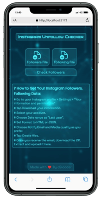

# 📉 Instagram Unfollow Checker

A simple React-based web tool that helps you compare your Instagram **followers** and **following** lists to detect:

- 🚫 Unfollowers (people you follow but they don’t follow you back)
- 🤝 Mutual Followers (people you follow and they follow you back)

---

## 🖼️ Demo



---

## 🚀 Features

✅ Upload Instagram data files (JSON or HTML)  
✅ Detect unfollowers and mutual followers  
✅ Highlight new unfollowers in bold white color 
✅ Sort lists (A-Z / Z-A)  
✅ Search/filter usernames  
✅ Export as CSV / PDF  
✅ Download ZIP (both lists)  
✅ Copy username  
✅ Modal popup for user info (click username)

---

## 📁 File Requirements

- **Followers File**: Can be `.json` (from Instagram data export) or `.html` (web page source)
- **Following File**: Same formats supported

📌 Must include `string_list_data` in JSON or anchor tags in HTML.

---

💻 Built With
---
- React

- JavaScript

- jsPDF

- JSZip

- HTML/CSS


## 🛠️ Installation

```bash
git clone https://github.com:psathul073/IG-Unfollow-Checker.git
cd unfollow-checker
npm install
npm run dev
```

🧠 How to Use
---
1. Upload both followers and following files

2. Click Check Followers

3. View the tables:

- 🤍 Bold white = new unfollower

- Sort or search if needed

4. Export results or copy usernames

📦 Exports
---
- CSV: Username list in .csv

- PDF: Printable user list

- ZIP: Includes both CSVs in one zip file


✍️ Author
---
Created by **Athul** (d9.coder)
